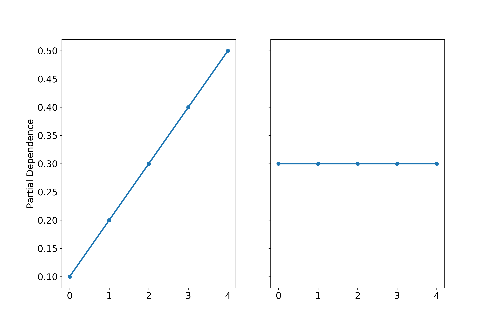

slide-dividers: #
slidenumbers: true

# Do You Want To Build a **Forest**?
[.header: alignment(center), text-scale(2.5)]
[.text: alignment(left), text-scale(1)]
[.slidenumbers: false]

Thomas J Fan
Scikit-learn Core Developer
@thomasjpfan

# Supervised learning  📖

$$
y = f(X)
$$

- X of shape `(n_samples, n_features)`
- y of shape `(n_samples,)`

# scikit-learn API  🛠

```py
from sklearn.experimental import enable_hist_gradient_boosting
from sklearn.ensemble import HistGradientBoostingClassifier

clf = HistGradientBoostingClassifier()

clf.fit(X, y)

clf.predict(X)

clf.score(X, y)
```

# Tree?  🌳


# Tree (Parameters)

```py
from sklearn.tree import DecisionTreeRegressor
from sklearn.tree import DecisionTreeClassifier

tree = DecisionTreeClassifier(
    max_depth=None, min_samples_leaf=1, ...)
```

# Forest

```py
from sklearn.ensemble import RandomForestClassifier
from sklearn.ensemble import RandomForestRegressor

rfc = RandomForestClassifier(n_estimators=100, ...)
rfr = RandomForestRegressor(n_estimators=100, ...)
```

🌲🌲🌲🌲🌲🌲🌲🌲🌲🌲🌲🌲🌲🌲🌲🌲🌲🌲🌲🌲🌲🌲🌲🌲🌲🌲🌲🌲
🌲🌲🌲🌲🌲🌲🌲🌲🌲🌲🌲🌲🌲🌲🌲🌲🌲🌲🌲🌲🌲🌲🌲🌲🌲🌲🌲🌲

# **Random**Forest

- `bootstrap=True`
- `max_features='auto'`
  - Regression: `n_features`
  - Classification: `sqrt(n_features)`

🌳🌲🌴🎄🌳🌲🌴🎄🌳🌲🌴🎄🌳🌲🌴🎄🌳🌲🌴🎄🌳🌲🌴🎄🌳🌲🌴🎄
🌳🌲🌴🎄🌳🌲🌴🎄🌳🌲🌴🎄🌳🌲🌴🎄🌳🌲🌴🎄🌳🌲🌴🎄🌳🌲🌴🎄

# Forest Details - Pruning (new in 0.22!)

```py
from sklearn.datasets import fetch_california_housing
from sklearn.model_selection import train_test_split

housing = fetch_california_housing()
X_train, X_test, y_train, y_test = train_test_split(
    housing.data, housing.target
)
```

# Forest Details - Pruning (new in 0.22!)

[.code-highlight: all]
[.code-highlight: 1-7]
[.code-highlight: 9-13]
[.code-highlight: 4-7,10-13]

```py
from sklearn.ensemble import RandomForestRegressor

rf = RandomForestRegressor().fit(X_train, y_train)
np.mean([est.tree_.node_count for est in rf.estimators_])
# 18736.58
rf.score(X_test, y_test)
# 0.7942

rf_pruned = RandomForestRegressor(ccp_alpha=1e-5).fit(X_train, y_train)
np.mean([est.tree_.node_count for est in rf_pruned.estimators_])
# 5687.18
rf_pruned.score(X_test, y_test)
# 0.7938
```

**30% of the nodes!**

# Forest Implementation

**Tree Building**

- Pure Python?
- Cython

**Forest Building**

- Parallelized with joblib

# joblib?

[.code-highlight: all]
[.code-highlight: 2-4]
[.code-highlight: 1,2,5]
[.code-highlight: 4-7]

```py
from math import sqrt
from joblib import Parallel, delayed

Parallel(n_jobs=4)(
    delayed(sqrt)(i**2)
    for i in range(10))
# [0.0, 1.0, 2.0, 3.0, 4.0, 5.0, 6.0, 7.0, 8.0, 9.0]
```

# Forest Building (joblib)

[.code-highlight: all]
[.code-highlight: 1-2]
[.code-highlight: 3-4]

**fit**

```py
trees = Parallel(n_jobs=self.n_jobs,
                 prefer="threads")(
    delayed(_parallel_build_trees)(...)
    for i, t in enumerate(trees))
```

# Forest Building (joblib)

[.code-highlight: all]
[.code-highlight: 1-2]
[.code-highlight: 4-6]
[.code-highlight: 1-2,7-9]

**predict_proba**

```py
all_proba = [...]
lock = threading.Lock()

trees = Parallel(n_jobs=self.n_jobs,
                 prefer="threads",
                 require='sharedmem')(
    delayed(_accumulate_prediction)(
        e.predict_proba, X, all_proba, lock)
    for e in self.estimators_)
```

# HistGradientBoosting (New in 0.21)

- @hug_nicolas - Associate Research Scientist @ Columbia University

**Deep Dive into scikit-learn's HistGradientBoosting Classifier and Regressor**
- [github.com/thomasjpfan/pydata-2019-histgradientboosting](https://github.com/thomasjpfan/pydata-2019-histgradientboosting)

# HistGradient**Boosting**

$$
f(X) = h_0(X) + h_1(X) + h_2(X) + ...
$$

$$
f(X) = \sum_i h_i(X)
$$

# Hist**Gradient**Boosting (`loss`)

- **Regression**
    1. `least_squares`
    1. `least_absolute_deviation`

- **Classificaiton**
    1. `binary_crossentropy`
    1. `categorical_crossentropy`

# Gradient - `least_squares`

**Loss**

$$
L(y, f(X)) = \frac{1}{2}||y - f(X)||^2
$$

**Gradient**

$$
\nabla L(y, f(X)) = -(y - f(X))
$$

# Gradient Boosting 🏂

- Initial Condition

$$
f_0(X) = C
$$

- Recursive Condition

$$
f_{m+1}(X) = f_{m}(X) - \eta \nabla L(y, f_{m}(X))
$$

where $$\eta$$ is the learning rate

# Gradient Boosting 🏂 - `least_squares`

$$
f_{m+1}(X) = f_{m}(X) + \eta h_{m}(X)
$$

- where $$h_{m}(X)=(y - f_m(X))$$

- We need to learn $$h_{m}(X)$$!

# How to learn $$h_m(X)$$?

[.header: alignment(center), text-scale(2)]
[.text: alignment(center), text-scale(2)]
🌲!

# **Hist**GradientBoosting


# **Hist**GradientBoosting


# HistGradientBoosting (overview)

1. Bin data
1. Make initial predictions (constant)
1. Calculate gradients and hessians
1. Grow Trees For Boosting
    1. Find best splits
    1. Add tree to predictors
    1. Update gradients and hessians


# Implementation? 🤔

- Pure Python?
- Cython?
- Cython + OpenMP!

# OpenMP! (Bin data 🗑, Pt 1)

1. _**Bin data**_
1. Make initial predictions (constant)
1. Calculate gradients and hessians
1. Grow Trees For Boosting
    1. Find best splits by building histograms
    1. Add tree to predictors
    1. Update gradients and hessians

# OpenMP! (Bin data 🗑, Pt 2)

[.code-highlight: all]
[.code-highlight: 1]

```py
for i in range(data.shape[0]):
    left, right = 0, binning_thresholds.shape[0]
    while left < right:
        middle = (right + left - 1) // 2
        if data[i] <= binning_thresholds[middle]:
            right = middle
        else:
            left = middle + 1
    binned[i] = left
```

# OpenMP! (Bin data 🗑, Pt 3)

[.code-highlight: 1-4]

```py
# sklearn/ensemble/_hist_gradient_boosting/_binning.pyx
for i in prange(data.shape[0],
                schedule='static',
                nogil=True):
    left, right = 0, binning_thresholds.shape[0]
    while left < right:
        middle = (right + left - 1) // 2
        if data[i] <= binning_thresholds[middle]:
            right = middle
        else:
            left = middle + 1
    binned[i] = left
```

# OpenMP! (Find best splits ✂️, Pt 1)

1. Bin data
1. Make initial predictions (constant)
1. Calculate gradients and hessians
1. Grow Trees For Boosting
    1. _**Find best splits**_ by building histograms
    1. Add tree to predictors
    1. Update gradients and hessians

# OpenMP! (Find best splits ✂️, Pt 2)

```py
# sklearn/ensemble/_hist_gradient_boosting/splitting.pyx
for feature_idx in prange(n_features, schedule='static'):
    # For each feature, find best bin to split on
```

# OpenMP! (Update gradients and hessians 🏔, Pt 1)

1. Bin data
1. Make initial predictions (constant)
1. Calculate gradients and hessians
1. Grow Trees For Boosting
    1. Find best splits by building histograms
    1. Add tree to predictors
    2. _**Update gradients and hessians**_

# OpenMP! (Update gradients and hessians 🏔, Pt 2)

- `least_squares`

```py
# sklearn/ensemble/_hist_gradient_boosting/_loss.pyx
for i in prange(n_samples, schedule='static', nogil=True):
    gradients[i] = raw_predictions[i] - y_true[i]
```

# Hyperparameters (Boosting 🏂)

```py
from sklearn.experimental import enable_hist_gradient_boosting
from sklearn.ensemble import HistGradientBoostingClassifier
from sklearn.ensemble import HistGradientBoostingRegressor

HistGradientBoostingClassifier(
    learning_rate=0.1, max_iter=100, ...)
```

- `export OMP_NUM_THREADS=12`

# Benchmarks 🚀 (HIGGS Pt 1)

- 8800000 samples
- 28 features
- binary classification  (1 for signal, 0 for background)

# Benchmarks 🚀 (HIGGS Pt 2)

- `export OMP_NUM_THREADS=12`

| library  | time | roc auc | accuracy |
|----------|------|---------|----------|
| sklearn  | 38s  | 0.8125  | 0.7324   |
| lightgbm | 39s  | 0.8124  | 0.7322   |
| xgboost  | 48s  | 0.8126  | 0.7326   |
| catboost | 100s | 0.8004  | 0.7222   |

# Benchmarks 🚀 (HIGGS Pt 3)

- `export OMP_NUM_THREADS=4`

| library  | time (12 cores) | time (4 cores) |
|----------|------|---------|
| sklearn  | 38s  | 85s |
| lightgbm | 39s  | 86s |
| xgboost  | 48s  | 115s |
| catboost | 100s | 164s |

# Parallelization

- `RandomForest` - Cython + joblib
- `HistGradientBoosting` - Cython + OpenMP

# Model Inspection

```py
from sklearn.inspection import permutation_importance

from sklearn.inspection import partial_dependence
from sklearn.inspection import plot_partial_dependence
```

# Permutation Feature Importance (Pt 1)

```py
X_train = [
    [0, 1, 2],
    [1, 2, 3],
    [2, 1, 4],
    [3, 1, 9],
    [4, 3, 1]
]
y_train = [1, 0, 1, 1, 0]

model.fit(X_train, y_train)
model.score(X_train, y_train)
# 0.90
```

# Permutation Feature Importance (Pt 2)

```py
X_train_perm_1 = [
    [1, 1, 2],
    [0, 2, 3],
    [2, 1, 4],
    [4, 1, 9],
    [3, 3, 1]
]
model.score(X_train_perm_1, y_train)
# 0.70
```

# Permutation Feature Importance (Pt 3)

```py
X_train_perm_2 = [
    [1, 1, 2],
    [3, 2, 3],
    [4, 1, 4],
    [2, 1, 9],
    [0, 3, 1]
]
model.score(X_train_perm_1, y_train)
# 0.73
```

# Permutation Feature Importance (Pt 4)

```py
model.score(X_train_perm_3, y_train)
# 0.80
```

- Recall: `model.score(X_train, y_train) = 0.90`
- permutation feature importance for the 0th feature:

```py
[0.90 - 0.70, 0.90 - 0.73, 0.90 - 0.80]
# [0.20, 0.17, 0.10]
```

# Permutation Feature Importance (Pt 5)

[.code-highlight: all]
[.code-highlight: 1-3]
[.code-highlight: 5-10]

```py
from sklearn.inspection import permutation_importance

result = permutation_importance(model, X, y, n_repeats=3)

result['importances']
# [[0.20, 0.17, 0.10], [0.5, 0.4, 0.6], ...]
result['importances_mean']
# [ 0.157, 0.5, ...]
result['importances_std']
# [0.0419 0.0816, ...])
```

# Permutation vs Impurity based Feature Imporantance

[.code-highlight: all]
[.code-highlight: 1-3]
[.code-highlight: 5-7]

```py
from sklearn.datasets import fetch_openml
X, y = fetch_openml("titanic", version=1,
                    as_frame=True, return_X_y=True)

rng = np.random.RandomState(seed=42)
X['random_cat'] = rng.randint(3, size=X.shape[0])
X['random_num'] = rng.randn(X.shape[0])
```

# Permutation vs Impurity (Pt 2)

[.code-highlight: all]
[.code-highlight: 1-4]
[.code-highlight: 6-7]

```py
categorical_columns = ['pclass', 'sex', 'embarked', 'random_cat']
numerical_columns = ['age', 'sibsp', 'parch', 'fare', 'random_num']

X = X[categorical_columns + numerical_columns]

X_train, X_test, y_train, y_test = train_test_split(X, y, stratify=y)
```

# Permutation vs Impurity (Pt 3)

[.code-highlight: all]
[.code-highlight: 1-5]
[.code-highlight: 6-8]
[.code-highlight: 10-12]


```py
categorical_pipe = Pipeline([
    ('imputer', SimpleImputer(strategy='constant',
                              fill_value='missing')),
    ('onehot', OneHotEncoder(handle_unknown='ignore'))
])
numerical_pipe = Pipeline([
    ('imputer', SimpleImputer(strategy='mean'))
])

col_transformer = ColumnTransformer(
    [('cat', categorical_pipe, categorical_columns),
     ('num', numerical_pipe, numerical_columns)])
```

# Permutation vs Impurity (Pt 4)

[.code-highlight: all]
[.code-highlight: 1-6]
[.code-highlight: 8-12]

```py
rf = Pipeline([
    ('preprocess', col_transformer),
    ('classifier', RandomForestClassifier())
])

rf.fit(X_train, y_train)

print("RF train accuracy: %0.3f" % rf.score(X_train, y_train))
# RF train accuracy: 1.000

print("RF test accuracy: %0.3f" % rf.score(X_test, y_test))
# RF test accuracy: 0.817
```

---


---


---


# Permutation Importance, Correlated features (Pt 1)

[.code-highlight: all]
[.code-highlight: 1-4]
[.code-highlight: 6-10]
[.code-highlight: 6-12]

```py
from sklearn.datasets import make_classification
X, y = make_classification(n_features=4)
X.shape
# (100, 4)

X_train, X_test, y_train, y_test = train_test_split(X, y)

tree = RandomForestClassifier().fit(X_train, y_train)
tree.score(X_test, y_test)
# 0.8

result = permutation_importance(tree, X_train, y_train, n_repeats=30)
```

---


# Permutation Importance, Correlated features (Pt 2)

[.code-highlight: all]
[.code-highlight: 1-3]
[.code-highlight: 5-12]

```py
X = np.c_[X, X[:, 2]]
X.shape
# (100, 5)

X_train, X_test, y_train, y_test = train_test_split(X, y)

tree2 = RandomForestClassifier().fit(X_train, y_train)
tree2.score(X_test, y_test)
# 0.8

result = permutation_importance(tree2, X_train, y_train, n_repeats=30)
```

---


# Permutation Importance, Correlated Features (Pt 3)

[.code-highlight: all]
[.code-highlight: 1-5]
[.code-highlight: 7-13]

```py
from sklearn.datasets import load_breast_cancer

data = load_breast_cancer()
X, y = data.data, data.target
X_train, X_test, y_train, y_test = train_test_split(X, y)

clf = RandomForestClassifier(n_estimators=100)
clf.fit(X_train, y_train)

print("Accuracy on test data: {:.2f}".format(clf.score(X_test, y_test)))
# Accuracy on test data: 0.97

result = permutation_importance(clf, X_train, y_train, n_repeats=30)
```

---


---


---

# Permutation Importance, Correlated Features (Pt 4)

[.code-highlight: all]
[.code-highlight: 1-2]
[.code-highlight: 4-12]

```py
X_train_sel = X_train[:, selected_features]
X_test_sel = X_test[:, selected_features]

clf_sel = RandomForestClassifier(n_estimators=100)
clf_sel.fit(X_train_sel, y_train)

print("Accuracy on test data with features removed: {:.2f}".format(
      clf_sel.score(X_test_sel, y_test)))
# Accuracy on test data with features removed: 0.97

result = permutation_importance(clf_sel, X_train_sel, y_train,
                                n_repeats=30)
```

---


# Partial Dependence Plots (Pt 1)

```py
X_train = [
    [0, 1, 2],
    [1, 2, 3],
    [2, 4, 4],
    [3, 1, 9],
    [4, 3, 1]
]
y_train = [0.1, 0.2, 0.3, 0.4, 0.5]

model.fit(X_train, y_train)
```

# Partial Dependence Plots (Pt 2)

```py
X_train_0 = [
    [0, 1, 2],
    [0, 2, 3],
    [0, 4, 4],
    [0, 1, 9],
    [0, 3, 1]
]
model.predict(X_train_0).mean()
# 0.1
```

# Partial Dependence Plots (Pt 3)

```py
X_train_1 = [
    [1, 1, 2],
    [1, 2, 3],
    [1, 4, 4],
    [1, 1, 9],
    [1, 3, 1]
]
model.predict(X_train_1).mean()
# 0.2
```

# Partial Dependence Plots (Pt 4)

```py
model.predit(X_train_0).mean()
# 0.1

model.predit(X_train_1).mean()
# 0.2

model.predit(X_train_2).mean()
# 0.3

model.predit(X_train_3).mean()
# 0.4
```

---



# Partial Dependence With Cancer Data (Pt 1)

```py
from sklearn.experimental import enable_hist_gradient_boosting
from sklearn.ensemble import HistGradientBoostingClassifier

hist = HistGradientBoostingClassifier()
hist.fit(X_train_sel, y_train)

hist.score(X_test_sel, y_test)
# 0.965
```

# Partial Dependence With Cancer Data (Pt 2)

[.code-highlight: all]
[.code-highlight: 3-4]
[.code-highlight: 5-6]

```py
from sklearn.inspection import plot_partial_dependence

disp = plot_partial_dependence(
    hist, X_train_sel, n_cols=2,
    features=['mean radius', 'mean concavity',
              'mean texture', 'radius error'],
    feature_names=selected_feature_names)

disp.figure_.tight_layout()
```

---


# Partial Dependence With Cancer Data (Pt 3)

[.code-highlight: all]
[.code-highlight: 5-6]

```py
from sklearn.inspection import plot_partial_dependence

disp = plot_partial_dependence(
    hist, X_train_sel, n_cols=2,
    features=['mean radius', 'mean concavity',
              'mean smoothness', 'texture error'],
    feature_names=selected_feature_names)

disp.figure_.tight_layout()
```

---


# Partial Dependence With Cancer Data (Pt 5)

```py
disp.plot(n_cols=2,
          line_kw={'linewidth': 4})

disp.figure_.tight_layout()
```

---


# Partial Dependence With Cancer Data (Pt 6)

```py
disp.lines_[0, 0].set_linewidth(10)
disp.lines_[0, 1].set_linestyle('--')
disp.lines_[1, 0].set_color('r')

disp.axes_[1, 1].set_ylabel("Hello world")
disp.figure_
```

---


# Do You Want To Build a **Forest**?

```py
from sklearn.ensemble import RandomForestClassifier
from sklearn.ensemble import RandomForestRegressor

from sklearn.experimental import enable_hist_gradient_boosting
from sklearn.ensemble import HistGradientBoostingClassifier
from sklearn.ensemble import HistGradientBoostingRegressor

from sklearn.inspection import permutation_importance
from sklearn.inspection import plot_partial_dependence
```

- [github.com/thomasjpfan/pydata-2019-forest](https://github.com/thomasjpfan/pydata-2019-forest)
- **@thomasjpfan**
